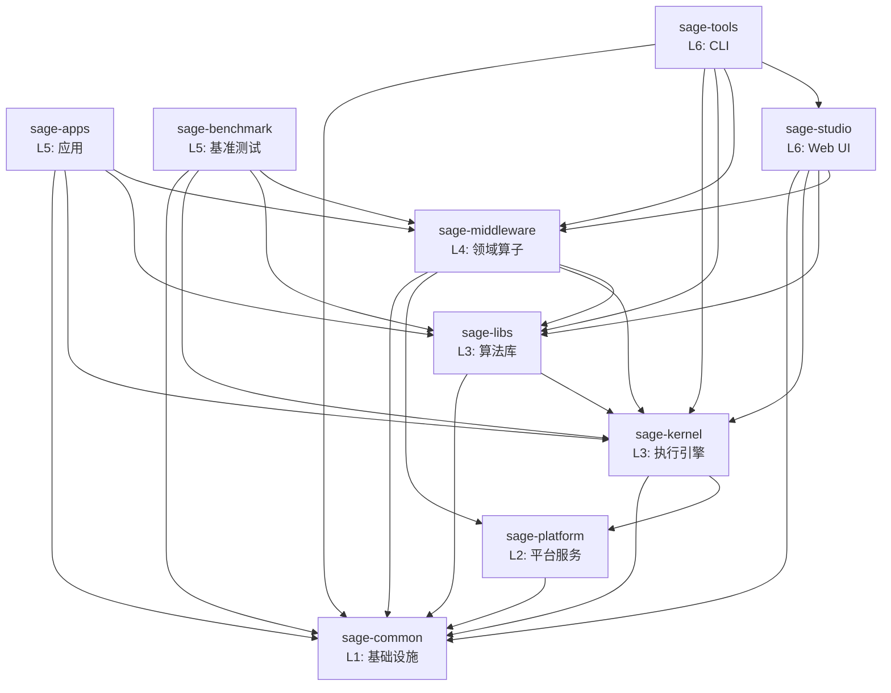

# SAGE 包结构与依赖

> **最后更新**: 2025-10-23

本文档详细描述 SAGE 各包的职责边界和依赖关系。

## 📦 完整包列表

| 包名 | 层级 | 职责 | 模块数 | 测试数 |
|------|------|------|--------|--------|
| sage-common | L1 | 基础设施 | 15+ | 119 |
| sage-platform | L2 | 平台服务 | 3 | 30 |
| sage-kernel | L3 | 流式引擎 | 268 | 753 |
| sage-libs | L3 | 算法库 | 65 | 169 |
| sage-middleware | L4 | 中间件 | 150 | 22 |
| sage-apps | L5 | 应用 | 24 | 21 |
| sage-benchmark | L5 | 基准测试 | 42 | 17 |
| sage-studio | L6 | Web UI | 8 | 51 |
| sage-tools | L6 | CLI | 106 | 78 |

## 🔗 依赖关系图



## 📋 包详细说明

### L1: sage-common

**位置**: `packages/sage-common/`

**核心模块**:
- `core`: 核心类型（Parameter, Record, WindowedRecord）
- `config`: 配置管理
- `utils`: 通用工具函数
- `components`: 基础组件（embedding, vllm, 向量数据库）
- `model_registry`: 模型注册表

**公共 API**:
```python
from sage.common import core, config, utils, components
from sage.common.core import Parameter, Record
```

**依赖**: 无

---

### L2: sage-platform

**位置**: `packages/sage-platform/`

**核心模块**:
- `queue`: 消息队列抽象（Python, Ray, RPC）
- `storage`: KV 存储接口（Dict, Redis, RocksDB）
- `service`: 服务基类

**公共 API**:
```python
from sage.platform.queue import RayQueueDescriptor
from sage.platform.storage import DictKVBackend
from sage.platform.service import BaseService
```

**依赖**: sage-common

**设计亮点**: 使用工厂模式解决 L2→L3 依赖问题
- 详见: [L2 Platform Layer](./design-decisions/l2-platform-layer.md)

---

### L3: sage-kernel

**位置**: `packages/sage-kernel/`

**核心模块**:
- `api`: LocalEnvironment, RemoteEnvironment
- `operators`: map, filter, join, window, aggregate
- `runtime`: 执行引擎、调度器
- `distributed`: 分布式计算支持
- `fault_tolerance`: 容错机制

**公共 API**:
```python
from sage.kernel.api import LocalEnvironment
from sage.kernel.api.function import MapFunction, SinkFunction
```

**依赖**: sage-common, sage-platform

---

### L3: sage-libs

**位置**: `packages/sage-libs/`

**最近更新**: 2025-10-23 - 完成模块重构

**核心模块** (10个):
- `agents`: Agents 框架 + Pre-built Bots
- `rag`: RAG 工具和 Pipeline
- `io`: I/O 工具 (重命名自 io_utils)
- `workflow`: 工作流优化 (重命名自 workflow_optimizer)
- `integrations`: 第三方集成 (OpenAI, Milvus, Chroma, HF)
- `filters`: 数据过滤器
- `tools`: 工具函数
- `context`: 上下文管理
- `unlearning`: 隐私遗忘

**公共 API**:
```python
from sage.libs.io import FileSource, TerminalSink
from sage.libs.agents.bots import AnswerBot, QuestionBot
from sage.libs.workflow import WorkflowGraph
from sage.libs.integrations import OpenAIClient
```

**依赖**: sage-common, sage-kernel (可选)

**重构详情**: [sage-libs Restructuring](./design-decisions/sage-libs-restructuring.md)

---

### L4: sage-middleware

**位置**: `packages/sage-middleware/`

**核心模块**:
- `operators.rag`: RAG 算子（检索、生成、评估）
- `operators.llm`: LLM 算子（对话、工具调用）
- `components.sage_mem`: 内存管理
- `components.sage_db`: 向量数据库
- `components.sage_refiner`: 文档精炼

**公共 API**:
```python
from sage.middleware.operators.rag import ChromaRetriever, QAPromptor
from sage.middleware.components import sage_mem, sage_db
```

**依赖**: sage-common, sage-platform, sage-kernel, sage-libs

---

### L5: sage-apps

**位置**: `packages/sage-apps/`

**应用列表**:
- `video`: 视频智能分析
- `medical_diagnosis`: 医疗诊断

**公共 API**:
```python
from sage.apps import video, medical_diagnosis
```

**依赖**: sage-common, sage-kernel, sage-libs, sage-middleware

---

### L5: sage-benchmark

**位置**: `packages/sage-benchmark/`

**基准测试**:
- `benchmark_rag`: RAG 性能测试
- `benchmark_memory`: 内存性能测试

**依赖**: sage-common, sage-kernel, sage-libs, sage-middleware

---

### L6: sage-studio

**位置**: `packages/sage-studio/`

**核心组件**:
- `StudioManager`: 主管理器
- `models`: 数据模型
- `services`: 服务层
- `adapters`: Pipeline 适配器

**依赖**: sage-common, sage-kernel, sage-libs, sage-middleware

---

### L6: sage-tools

**位置**: `packages/sage-tools/`

**CLI 命令**:
- `sage studio`: Web UI 管理
- `sage dev`: 开发工具
- `sage pipeline`: Pipeline 构建
- `sage llm/embedding`: 服务管理
- `sage job/cluster`: 作业管理

**依赖**: sage-common, sage-kernel, sage-libs, sage-middleware, sage-studio

## 🎯 依赖规则

### ✅ 允许的依赖模式

1. **向下依赖**:
   ```
   L6 → L5, L4, L3, L2, L1
   L5 → L4, L3, L2, L1
   L4 → L3, L2, L1
   L3 → L2, L1
   L2 → L1
   ```

2. **同层独立**:
   - kernel ⊥ libs (都是 L3)
   - apps ⊥ benchmark (都是 L5)
   - studio ⊥ tools (都是 L6)

### ❌ 禁止的依赖模式

1. **向上依赖**:
   ```
   L1 ❌→ 任何包
   L2 ❌→ L3+
   L3 ❌→ L4+
   ```

2. **循环依赖**:
   ```
   A → B → A ❌
   ```

3. **跨层依赖**:
   ```
   L5 ❌→ L2 (应该通过 L3)
   ```

## 🔍 架构验证

我们使用自动化工具验证架构合规性：

```bash
# 检查依赖违规
sage dev check-architecture

# 生成依赖图
sage dev visualize-deps
```

**当前状态**: ✅ 0 架构违规

## 📚 相关文档

- [架构总览](./overview.md)
- [分层设计](./layer-design.md)
- [设计决策记录](./design-decisions/)
