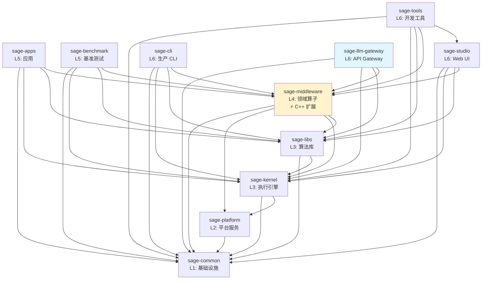

# SAGE 包结构与依赖

> **最后更新**: 2025-12-02
>
> **变更日志**:
> - 2025-12-02: 添加 sage-llm-gateway，更新统计数据，补充 C++ 扩展位置
> - 2025-10-23: 初始版本

本文档详细描述 SAGE 各包的职责边界和依赖关系。

## 📦 完整包列表

| 包名            | 层级 | 职责           | 模块数 | 测试数 | C++ 扩展 |
| --------------- | ---- | -------------- | ------ | ------ | -------- |
| sage-common     | L1   | 基础设施       | 15+    | 119    | -        |
| sage-platform   | L2   | 平台服务       | 3      | 30     | -        |
| sage-kernel     | L3   | 流式引擎       | 268    | 753    | -        |
| sage-libs       | L3   | 算法库         | 65     | 169    | -        |
| sage-middleware | L4   | 中间件         | 150    | 22     | ✅ sageFlow, NeuromMem |
| sage-apps       | L5   | 应用           | 24     | 21     | -        |
| sage-benchmark  | L5   | 基准测试       | 42     | 17     | -        |
| sage-studio     | L6   | Web UI         | 8      | 51     | -        |
| sage-cli        | L6   | 生产 CLI       | 45     | 32     | -        |
| sage-tools      | L6   | 开发工具       | 106    | 78     | -        |
| sage-llm-gateway    | L6   | API Gateway    | 8      | 37     | -        |

## 🔗 依赖关系图



## 📋 包详细说明

### L1: sage-common

**位置**: `packages/sage-common/`

**核心模块**:

- `core`: 核心类型（Parameter, Record, WindowedRecord）
- `config`: 配置管理
- `utils`: 通用工具函数
- `components`: 基础组件（embedding, vllm, 向量数据库）
- `model_registry`: 模型注册表

**公共 API**:

```python
from sage.common import core, config, utils, components
from sage.common.core import Parameter, Record
```

**依赖**: 无

______________________________________________________________________

### L2: sage-platform

**位置**: `packages/sage-platform/`

**核心模块**:

- `queue`: 消息队列抽象（Python, Ray, RPC）
- `storage`: KV 存储接口（Dict, Redis, RocksDB）
- `service`: 服务基类

**公共 API**:

```python
from sage.platform.queue import RayQueueDescriptor
from sage.platform.storage import DictKVBackend
from sage.platform.service import BaseService
```

**依赖**: sage-common

**设计亮点**: 使用工厂模式解决 L2→L3 依赖问题

- 详见: [L2 Platform Layer](./design-decisions/l2-platform-layer.md)

______________________________________________________________________

### L3: sage-kernel

**位置**: `packages/sage-kernel/`

**核心模块**:

- `api`: LocalEnvironment, RemoteEnvironment
- `operators`: map, filter, join, window, aggregate
- `runtime`: 执行引擎、调度器
- `distributed`: 分布式计算支持
- `fault_tolerance`: 容错机制

**公共 API**:

```python
from sage.kernel.api import LocalEnvironment
from sage.common.core.functions import MapFunction, SinkFunction
```

**依赖**: sage-common, sage-platform

______________________________________________________________________

### L3: sage-libs

**位置**: `packages/sage-libs/`

**最近更新**: 2025-10-23 - 完成模块重构

**核心模块** (10个):

- `agentic`: Agents 框架 + Pre-built Bots
- `rag`: RAG 工具和 Pipeline
- `io`: I/O 工具 (重命名自 io_utils)
- `workflow`: 工作流优化 (重命名自 workflow_optimizer)
- `integrations`: 第三方集成 (OpenAI, Milvus, Chroma, HF)
- `filters`: 数据过滤器
- `tools`: 工具函数
- `context`: 上下文管理
- `unlearning`: 隐私遗忘

**公共 API**:

```python
from sage.libs.io import FileSource, TerminalSink
from sage.libs.agentic.agents.bots import AnswerBot, QuestionBot
from sage.libs.workflow import WorkflowGraph
from sage.libs.integrations import OpenAIClient
```

**依赖**: sage-common, sage-kernel (可选)

**重构详情**: [sage-libs Restructuring](./design-decisions/sage-libs-restructuring.md)

______________________________________________________________________

### L4: sage-middleware

**位置**: `packages/sage-middleware/`

**核心模块**:

- `operators.rag`: RAG 算子（检索、生成、评估）
- `operators.llm`: LLM 算子（对话、工具调用）
- `components.sage_mem`: 内存管理（含 NeuromMem C++ 扩展）
- `components.sage_db`: 向量数据库
- `components.sage_flow`: 高性能向量检索（sageFlow C++ 扩展）
- `components.sage_refiner`: 文档精炼

**C++ 扩展位置**:

| 组件 | 路径 | 描述 |
|------|------|------|
| sageFlow | `components/sage_flow/sageFlow/` | 高性能向量检索引擎 |
| NeuromMem | `components/sage_mem/neuromem/` | 神经记忆系统 |

**公共 API**:

```python
from sage.middleware.operators.rag import ChromaRetriever, QAPromptor
from sage.middleware.components import sage_mem, sage_db, sage_flow
```

**依赖**: sage-common, sage-platform, sage-kernel, sage-libs

______________________________________________________________________

### L5: sage-apps

**位置**: `packages/sage-apps/`

**应用列表**（与 `examples/apps/run_*.py` 启动脚本一一对应）:

- `article_monitoring`: arXiv 监控与推荐（入口：`run_article_monitoring.py`）
- `auto_scaling_chat`: 弹性扩缩容聊天演示（入口：`run_auto_scaling_chat.py`）
- `smart_home`: IoT 智能家居工作流（入口：`run_smart_home.py`）
- `video`: 视频智能分析（入口：`run_video_intelligence.py`）
- `medical_diagnosis`: 医疗诊断系统（入口：`run_medical_diagnosis.py`）

**公共 API**:

```python
from sage.apps import article_monitoring, auto_scaling_chat, smart_home, video, medical_diagnosis
```

> 详见 `docs/dev-notes/l5-apps/README.md` 获取最新的 L5 示例与测试策略。教程示例按照 L1-L6 存放于 `examples/tutorials/`，而完整应用通过 `examples/apps/` 调用本层实现。

**依赖**: sage-common, sage-kernel, sage-libs, sage-middleware

______________________________________________________________________

### L5: sage-benchmark

**位置**: `packages/sage-benchmark/`

**基准测试**:

- `benchmark_rag`: RAG 性能测试
- `benchmark_memory`: 内存性能测试

**依赖**: sage-common, sage-kernel, sage-libs, sage-middleware

______________________________________________________________________

### L6: sage-studio

**位置**: `packages/sage-studio/`

**核心组件**:

- `StudioManager`: 主管理器
- `models`: 数据模型
- `services`: 服务层
- `adapters`: Pipeline 适配器

**依赖**: sage-common, sage-kernel, sage-libs, sage-middleware

______________________________________________________________________

### L6: sage-cli

**位置**: `packages/sage-cli/`

**核心命令** (生产运维):

- `sage cluster`: Ray 集群管理
- `sage head`: 头节点管理
- `sage worker`: 工作节点管理
- `sage job`: 作业管理
- `sage deploy`: 应用部署

**公共 API**:

```python
from sage.cli import cluster, job, deploy
```

**依赖**: sage-common, sage-kernel, sage-libs, sage-middleware

______________________________________________________________________

### L6: sage-tools

**位置**: `packages/sage-tools/`

**开发工具** (开发调试):

- `sage-dev`: 开发辅助工具（quality, project, maintain, package, docs）
- `sage studio`: Web UI 管理（调用 sage-studio）
- `sage pipeline`: Pipeline 构建工具
- `sage llm/embedding`: LLM/Embedding 服务管理
- 测试、代码质量检查等

**sage-cli vs sage-tools**:

| 工具 | 定位 | 典型命令 |
|------|------|----------|
| `sage` (sage-cli) | 生产运维 | `sage cluster start`, `sage job submit` |
| `sage-dev` (sage-tools) | 开发调试 | `sage-dev quality`, `sage-dev project test` |

**依赖**: sage-common, sage-kernel, sage-libs, sage-middleware, sage-studio

______________________________________________________________________

### L6: sage-llm-gateway

**位置**: `packages/sage-llm-gateway/`

**PyPI 发布名**: `isage-llm-gateway`

**职责**: OpenAI 兼容 API Gateway，将请求转换为 SAGE DataStream/RAG 流水线执行

**核心功能**:

- `/v1/chat/completions`: OpenAI Chat 接口（流式 + 非流式）
- `/sessions/**`: 聊天会话管理
- `/memory/**`: 记忆后端配置
- `/admin/index/**`: RAG 索引管理

**启动方式**:

```bash
sage-llm-gateway --host 0.0.0.0 --port 8000
# 或
python -m sage.llm.gateway.server
```

**依赖**: sage-common, sage-kernel, sage-libs, sage-middleware

## 🎯 依赖规则

### ✅ 允许的依赖模式

1. **向下依赖**:

   ```
   L6 → L5, L4, L3, L2, L1
   L5 → L4, L3, L2, L1
   L4 → L3, L2, L1
   L3 → L2, L1
   L2 → L1
   ```

1. **同层独立**:

   - kernel ⊥ libs (都是 L3)
   - apps ⊥ benchmark (都是 L5)
   - studio ⊥ cli ⊥ tools ⊥ gateway (都是 L6)

### ❌ 禁止的依赖模式

1. **向上依赖**:

   ```
   L1 ❌→ 任何包
   L2 ❌→ L3+
   L3 ❌→ L4+
   ```

1. **循环依赖**:

   ```
   A → B → A ❌
   ```

1. **跨层依赖**:

   ```
   L5 ❌→ L2 (应该通过 L3)
   ```

## 🔍 架构验证

我们使用自动化工具验证架构合规性：

```bash
# 检查依赖违规
sage-dev check-architecture

# 生成依赖图
sage-dev visualize-deps
```

**当前状态**: ✅ 0 架构违规

## 📚 相关文档

- [架构总览](./overview.md)
- [设计决策记录](./design-decisions/l2-platform-layer.md)
- [开发笔记 - 包架构](../../dev-notes/package-architecture.md)
