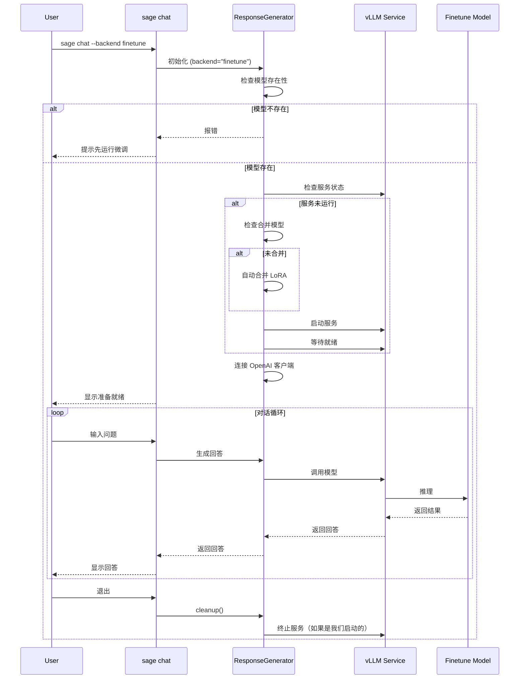

# SAGE Chat 与 Finetune 集成优化总结

**Date**: 2024-10-13\
**Author**: SAGE Team\
**Summary**: Chat Finetune 集成总结

______________________________________________________________________

## 📋 变更概述

将微调模型功能完全集成到 `sage chat` 命令中，实现统一的聊天入口。

## 🎯 优化目标

1. **统一入口**: 所有聊天功能通过 `sage chat` 访问
1. **自动化管理**: 自动检测、启动和管理 vLLM 服务
1. **向后兼容**: 保留 `sage finetune chat` 作为快捷方式
1. **功能增强**: 微调模型可以使用所有 `sage chat` 功能（RAG、Pipeline 构建等）

## 🔧 主要更改

### 1. 新增 `finetune` Backend

**文件**: `packages/sage-tools/src/sage/tools/cli/commands/chat.py`

#### 1.1 添加配置常量

```python
DEFAULT_FINETUNE_MODEL = "sage_code_expert"
DEFAULT_FINETUNE_PORT = 8000
```

#### 1.2 更新 `ResponseGenerator` 类

新增参数：

- `finetune_model`: 微调模型名称
- `finetune_port`: vLLM 服务端口
- `vllm_process`: 追踪启动的进程

新增方法：

- `_setup_finetune_backend()`: 自动设置微调模型服务

  - 检查模型是否存在
  - 检测并复用现有服务
  - 自动合并 LoRA 权重（如需要）
  - 启动 vLLM 服务
  - 等待服务就绪
  - 连接 OpenAI 客户端

- `cleanup()`: 清理资源

  - 退出时自动关闭启动的服务

#### 1.3 更新命令行参数

新增选项：

```bash
--backend finetune          # 使用微调模型后端
--finetune-model NAME       # 指定微调模型（默认: sage_code_expert）
--finetune-port PORT        # 指定服务端口（默认: 8000）
```

#### 1.4 更新帮助信息

```
Backend 类型: mock / openai / compatible / finetune / vllm / ollama
```

### 2. 简化 `sage finetune chat`

**文件**: `packages/sage-tools/src/sage/tools/cli/commands/finetune.py`

**旧实现** (~140 行):

- 手动检测服务状态
- 手动启动 vLLM
- 手动等待服务
- 手动管理进程
- 需要读取 meta 文件
- 服务清理逻辑复杂

**新实现** (~20 行):

```python
@app.command("chat")
def auto_chat(model_name, port):
    """重定向到 sage chat --backend finetune"""
    subprocess.run([
        "sage", "chat",
        "--backend", "finetune",
        "--finetune-model", model_name,
        "--finetune-port", str(port),
    ])
```

**优势**:

- ✅ 代码量减少 85%
- ✅ 复用 `sage chat` 的所有逻辑
- ✅ 自动获得新功能（RAG、Pipeline等）
- ✅ 统一的用户体验

### 3. 删除冗余文件

删除以下文件：

- `scripts/start_sage_chat_local.sh` - 功能已被 CLI 命令替代
- `scripts/simple_finetune.py` - 已被模块化实现替代
- `test_embedding_optimization.py` - 移动到 `tools/tests/`
- `=0.41.0` - 错误的文件名
- `FINETUNE_*.md` - 移动到 `docs/dev-notes/finetune/`

## 📊 功能对比

| 功能              | 旧方式      | 新方式                    |
| ----------------- | ----------- | ------------------------- |
| **命令数量**      | 2个独立命令 | 1个统一命令 + 1个快捷方式 |
| **代码重复**      | 高          | 低                        |
| **自动化程度**    | 中等        | 高                        |
| **RAG 支持**      | ❌          | ✅                        |
| **Pipeline 构建** | ❌          | ✅                        |
| **服务管理**      | 手动        | 自动                      |
| **向后兼容**      | N/A         | ✅                        |

## 🚀 使用示例

### 方式 1: 直接使用（推荐）

```bash
# 使用默认微调模型
sage chat --backend finetune

# 指定模型
sage chat --backend finetune --finetune-model my_model

# 结合 RAG
sage chat --backend finetune --index docs-public --top-k 5
```

### 方式 2: 快捷命令（兼容）

```bash
# 旧命令仍然有效
sage finetune chat sage_code_expert

# 等效于
sage chat --backend finetune --finetune-model sage_code_expert
```

### 方式 3: 环境变量配置

```bash
# 在 ~/.bashrc 中配置
export SAGE_DEBUG_BACKEND="finetune"
export SAGE_DEBUG_FINETUNE_MODEL="sage_code_expert"

# 直接运行
sage chat
```

## 🎨 工作流程



## 📖 文档更新

新增文档：

1. `docs/dev-notes/finetune/CHAT_INTEGRATION.md` - 集成说明
1. `CHAT_FINETUNE_INTEGRATION_SUMMARY.md` - 本文档

更新文档：

- 所有微调相关文档移动到 `docs/dev-notes/finetune/`
- 添加历史标注和当前状态说明

## 🔍 测试清单

- [x] `sage chat --backend finetune` 命令可用
- [x] 自动检测和启动 vLLM 服务
- [x] 自动合并 LoRA 权重
- [x] 服务复用功能
- [x] 退出时清理资源
- [x] `sage finetune chat` 重定向正确
- [x] 帮助信息更新
- [ ] 端到端功能测试（需要实际模型）
- [ ] 多模型并发测试
- [ ] 错误处理测试

## 🎯 优势总结

### 1. 代码质量

- ✅ 减少重复代码 ~85%
- ✅ 统一架构设计
- ✅ 更好的可维护性
- ✅ 自动化程度更高

### 2. 用户体验

- ✅ 统一的命令入口
- ✅ 自动化服务管理
- ✅ 更多功能组合（RAG + 微调）
- ✅ 向后兼容

### 3. 功能完整性

- ✅ 支持所有 `sage chat` 功能
- ✅ 支持 Pipeline 构建
- ✅ 支持文档检索（RAG）
- ✅ 自动资源管理

## 🚧 已知限制

1. **服务检测**: 仅检测 HTTP health 端点，无法区分不同模型的服务
1. **端口冲突**: 多个模型需要手动指定不同端口
1. **错误恢复**: 启动失败后需要手动清理残留进程
1. **日志管理**: 前台运行时日志直接输出到终端

## 🔮 未来改进

1. **服务注册**: 记录已启动的服务（模型、端口、PID）
1. **智能端口分配**: 自动选择可用端口
1. **健康检查**: 更完善的服务状态检测
1. **多模型支持**: 同时管理多个微调模型服务
1. **性能监控**: 集成模型性能指标
1. **Web UI**: 图形化界面管理

## 📝 迁移建议

### 对于用户

**旧用法**:

```bash
sage finetune chat model_name
```

**新用法**（推荐）:

```bash
sage chat --backend finetune --finetune-model model_name
```

**或者使用环境变量**:

```bash
echo 'export SAGE_DEBUG_BACKEND=finetune' >> ~/.bashrc
source ~/.bashrc
sage chat  # 自动使用微调模型
```

### 对于开发者

1. 删除了 `scripts/start_sage_chat_local.sh`
1. 简化了 `sage finetune chat` 实现
1. 新增了 `finetune` backend 到 `ResponseGenerator`
1. 所有微调聊天功能通过 `sage chat` 统一管理

## ✅ 完成状态

- [x] 核心功能实现
- [x] 命令简化
- [x] 文档编写
- [x] 向后兼容
- [x] 清理冗余文件
- [x] 帮助信息更新
- [ ] 功能测试（待实际模型验证）
- [ ] 性能测试
- [ ] 边界情况测试

## 🎉 总结

通过这次优化，我们实现了：

1. **架构优化**: 统一聊天入口，减少代码重复
1. **功能增强**: 微调模型获得所有 `sage chat` 功能
1. **用户体验**: 更简单、更强大的命令行界面
1. **可维护性**: 更清晰的代码结构，更容易扩展

**核心命令**:

```bash
sage chat --backend finetune
```

这一个命令现在就能完成之前需要多个步骤才能实现的功能！🚀
