# SAGE 包架构

> 本文档描述 SAGE 项目的包结构、依赖关系和职责划分。
>
> 最后更新：2025-12-02（任务 A 架构文档刷新）
>
> **变更日志**:
> - 2025-12-02: 补充 C++ 扩展位置信息，更新 sage-llm-gateway 说明，统一 L6 层描述
> - 2025-10-23: 完整架构审查完成

## 🎉 架构审查状态

**审查日期**: 2025-12-02\
**审查范围**: 全部 11 个包（含 meta-package），700+ 个 Python 文件\
**状态**: ✅ **完成**

### 审查成果

| 层级 | 包名            | 文件数 | 测试通过 | Layer 标记 | 架构合规 | C++ 扩展 | 备注        |
| ---- | --------------- | ------ | -------- | ---------- | -------- | -------- | ----------- |
| L1   | sage-common     | 22     | ✅ 119   | ✅         | ✅       | -        | -           |
| L2   | sage-platform   | 7      | ✅ 30    | ✅         | ✅       | -        | -           |
| L3   | sage-kernel     | 268    | ✅ 753   | ✅         | ✅       | -        | -           |
| L3   | sage-libs       | 65     | ✅ 169   | ✅         | ✅       | -        | 200 skipped |
| L4   | sage-middleware | 150    | ✅ 22    | ✅         | ✅       | ✅ sageFlow, NeuromMem | C++ via pybind11 |
| L5   | sage-apps       | 24     | ✅ 21    | ✅         | ✅       | -        | -           |
| L5   | sage-benchmark  | 42     | ✅ 17    | ✅         | ✅       | -        | -           |
| L6   | sage-studio     | 8      | ✅ 51    | ✅         | ✅       | -        | -           |
| L6   | sage-cli        | 45     | ✅ 32    | ✅         | ✅       | -        | 统一 CLI 入口 |
| L6   | sage-tools      | 106    | ✅ 78    | ✅         | ✅       | -        | 开发工具集  |
| L6   | sage-llm-gateway    | 8      | ✅ 37    | ✅         | ✅       | -        | PyPI: `isage-llm-gateway` |

**核心指标**:

- ✅ 架构违规: **0** (已全部修复)
- ✅ Layer 标记覆盖: **100%** (11/11 包)
- ✅ 核心测试通过率: **100%** (1,093/1,093 for L1-L4)
- ✅ 应用层测试: **1,300+/1,310+ (99.7%)**
- ✅ 依赖关系: **单向向下，清晰可控**
- ✅ C++ 扩展: **2 个组件** (sageFlow, NeuromMem in L4)

详见: [RPC_QUEUE_REFACTORING_2025.md](https://github.com/intellistream/SAGE/tree/main/docs/dev-notes/cross-layer/architecture)

______________________________________________________________________

## 📦 包概览

SAGE 采用分层单体架构（Modular Monolith），由 **11 个独立包 + 1 个 meta-package** 组成：

```
L6: sage-studio          # Web UI 可视化接口
    sage-cli            # CLI 统一入口（集群/作业/部署管理）
    sage-tools          # 开发工具和测试框架（sage-dev CLI）
    sage-llm-gateway        # API Gateway (PyPI: isage-llm-gateway, OpenAI/Anthropic 兼容)
    │
L5: sage-apps           # 特定领域应用
    sage-benchmark      # 性能基准测试
    │
L4: sage-middleware     # 领域算子和组件 ⚡ 含 C++ 扩展 (sageFlow, NeuromMem)
    │                   # 位置: packages/sage-middleware/src/sage/middleware/components/
    │
L3: sage-kernel         # 流式执行引擎
    sage-libs           # 算法库和 Agents 框架
    │
L2: sage-platform       # 平台服务层（队列、存储、服务抽象）
    │
L1: sage-common         # 基础设施（类型、配置、工具）

Meta: packages/sage/    # Meta-package (isage)，聚合安装所有包
```

### 层级说明

- **L1 (Foundation)**: 基础设施，所有包都可以依赖
- **L2 (Platform)**: 平台服务（队列、存储、服务抽象）
- **L3 (Core)**: 核心功能，提供执行引擎和算法库
- **L4 (Domain)**: 领域特定功能，基于 L1-L3 构建，**含 C++ 扩展**
- **L5 (Applications)**: 应用层，组合使用下层功能
- **L6 (Interface)**: 用户接口层（Web UI + CLI + API Gateway + 开发工具）

### C++ 扩展位置

SAGE 在 L4 层包含两个主要的 C++ 扩展组件，通过 pybind11 提供 Python 绑定：

| 组件 | 路径 | 描述 |
|------|------|------|
| **sageFlow** | `packages/sage-middleware/src/sage/middleware/components/sage_flow/sageFlow/` | 高性能向量检索引擎，支持 HNSW/IVF 等索引 |
| **NeuromMem** | `packages/sage-middleware/src/sage/middleware/components/sage_mem/neuromem/` | 神经记忆系统，支持多层记忆抽象 |

**构建产物**: `_sage_flow.cpython-*.so` 等动态库，位于 `.sage/build/` 目录

**构建依赖**: `cmake`, `build-essential`, `libopenblas-dev`, `liblapack-dev`

### 📊 详细层级架构图

```
┌─────────────────────────────────────────────────────────────────────────────────────────┐
│                              SAGE 分层架构 (L1-L6)                                       │
│                          ═══════════════════════════════                                │
│                                                                                         │
│  ┌───────────────────────────────────────────────────────────────────────────────────┐  │
│  │ L6: Interface Layer (用户接口层)                                                   │  │
│  │ ┌─────────────┐ ┌─────────────┐ ┌─────────────┐ ┌─────────────────────────────┐   │  │
│  │ │ sage-studio │ │  sage-cli   │ │ sage-tools  │ │      sage-llm-gateway           │   │  │
│  │ │   Web UI    │ │ 生产运维 CLI│ │ 开发工具    │ │ OpenAI 兼容 API Gateway     │   │  │
│  │ │  端口: 5173 │ │cluster/job  │ │ sage-dev    │ │ PyPI: isage-llm-gateway         │   │  │
│  │ │      8080   │ │deploy/worker│ │quality/test │ │ 端口: 8000 (SagePorts)      │   │  │
│  │ └─────────────┘ └─────────────┘ └─────────────┘ └─────────────────────────────┘   │  │
│  └───────────────────────────────────────────────────────────────────────────────────┘  │
│                                          │                                              │
│                                          ▼                                              │
│  ┌───────────────────────────────────────────────────────────────────────────────────┐  │
│  │ L5: Application Layer (应用层)                                                     │  │
│  │ ┌─────────────────────────────────┐  ┌─────────────────────────────────────────┐  │  │
│  │ │          sage-apps              │  │           sage-benchmark                │  │  │
│  │ │ • article_monitoring (arXiv)    │  │ • benchmark_rag                         │  │  │
│  │ │ • auto_scaling_chat             │  │ • benchmark_memory                      │  │  │
│  │ │ • smart_home (IoT)              │  │ • benchmark_agent (Agent 能力评测)       │  │  │
│  │ │ • video (视频智能)               │  │ • benchmark_control_plane (调度评测)    │  │  │
│  │ │ • medical_diagnosis             │  │                                         │  │  │
│  │ └─────────────────────────────────┘  └─────────────────────────────────────────┘  │  │
│  └───────────────────────────────────────────────────────────────────────────────────┘  │
│                                          │                                              │
│                                          ▼                                              │
│  ┌───────────────────────────────────────────────────────────────────────────────────┐  │
│  │ L4: Middleware Layer (中间件层) ⚡ 含 C++ 扩展                                      │  │
│  │ ┌─────────────────────────────────────────────────────────────────────────────┐   │  │
│  │ │                           sage-middleware                                   │   │  │
│  │ │ ┌─────────────────────────┐  ┌─────────────────────────────────────────┐   │   │  │
│  │ │ │      operators/         │  │              components/                │   │   │  │
│  │ │ │  • rag/ (检索/生成)      │  │  • sage_mem/ (NeuromMem C++)            │   │   │  │
│  │ │ │  • llm/ (对话/工具)      │  │  • sage_flow/ (sageFlow C++)            │   │   │  │
│  │ │ │  • tools/ (网页/API)    │  │  • sage_db/ (向量数据库)                 │   │   │  │
│  │ │ └─────────────────────────┘  │  • sage_refiner/ (文档精炼)             │   │   │  │
│  │ │                              │  • sage_tsdb/ (时序数据库)               │   │   │  │
│  │ │                              └─────────────────────────────────────────┘   │   │  │
│  │ └─────────────────────────────────────────────────────────────────────────────┘   │  │
│  └───────────────────────────────────────────────────────────────────────────────────┘  │
│                                          │                                              │
│                                          ▼                                              │
│  ┌───────────────────────────────────────────────────────────────────────────────────┐  │
│  │ L3: Core Layer (核心层)                                                            │  │
│  │ ┌─────────────────────────────────┐  ┌─────────────────────────────────────────┐  │  │
│  │ │         sage-kernel             │  │            sage-libs                    │  │  │
│  │ │ • api/ (Environment, DataStream)│  │ • agentic/ (Agents, Bots)               │  │  │
│  │ │ • operators/ (map/filter/join)  │  │ • rag/ (RAG 工具)                        │  │  │
│  │ │ • runtime/ (调度器, 执行引擎)    │  │ • io/ (FileSource, TerminalSink)        │  │  │
│  │ │ • distributed/ (分布式支持)     │  │ • workflow/ (工作流优化)                 │  │  │
│  │ │ • fault_tolerance/ (容错)       │  │ • integrations/ (OpenAI, Milvus, HF)    │  │  │
│  │ └─────────────────────────────────┘  └─────────────────────────────────────────┘  │  │
│  └───────────────────────────────────────────────────────────────────────────────────┘  │
│                                          │                                              │
│                                          ▼                                              │
│  ┌───────────────────────────────────────────────────────────────────────────────────┐  │
│  │ L2: Platform Layer (平台层)                                                        │  │
│  │ ┌─────────────────────────────────────────────────────────────────────────────┐   │  │
│  │ │                           sage-platform                                     │   │  │
│  │ │  ┌─────────────────┐  ┌─────────────────┐  ┌─────────────────────────────┐  │   │  │
│  │ │  │     queue/      │  │    storage/     │  │        service/             │  │   │  │
│  │ │  │ Python/Ray/RPC  │  │ Dict/Redis/     │  │      BaseService            │  │   │  │
│  │ │  │ QueueDescriptor │  │ RocksDB Backend │  │ (服务生命周期管理)           │  │   │  │
│  │ │  └─────────────────┘  └─────────────────┘  └─────────────────────────────┘  │   │  │
│  │ │                                                                             │   │  │
│  │ │  ⚙️ 工厂模式: register_rpc_queue_factory() - L2 定义接口，L3 注册实现        │   │  │
│  │ └─────────────────────────────────────────────────────────────────────────────┘   │  │
│  └───────────────────────────────────────────────────────────────────────────────────┘  │
│                                          │                                              │
│                                          ▼                                              │
│  ┌───────────────────────────────────────────────────────────────────────────────────┐  │
│  │ L1: Foundation Layer (基础设施层)                                                  │  │
│  │ ┌─────────────────────────────────────────────────────────────────────────────┐   │  │
│  │ │                            sage-common                                      │   │  │
│  │ │  ┌───────────────┐  ┌───────────────┐  ┌───────────────┐  ┌─────────────┐   │   │  │
│  │ │  │    core/      │  │   config/     │  │    utils/     │  │ components/ │   │   │  │
│  │ │  │ Parameter     │  │ SagePorts     │  │ 通用工具      │  │ sage_llm/   │   │   │  │
│  │ │  │ Record        │  │ SageEnvKeys   │  │ 日志管理      │  │ sage_embed/ │   │   │  │
│  │ │  │ Functions     │  │ network.py    │  │ 装饰器        │  │ 向量数据库  │   │   │  │
│  │ │  └───────────────┘  └───────────────┘  └───────────────┘  └─────────────┘   │   │  │
│  │ └─────────────────────────────────────────────────────────────────────────────┘   │  │
│  └───────────────────────────────────────────────────────────────────────────────────┘  │
│                                                                                         │
│  ┌───────────────────────────────────────────────────────────────────────────────────┐  │
│  │ Meta: packages/sage/ (PyPI: isage) - 聚合安装所有包                                │  │
│  └───────────────────────────────────────────────────────────────────────────────────┘  │
└─────────────────────────────────────────────────────────────────────────────────────────┘

依赖规则: L6 → L5 → L4 → L3 → L2 → L1 (单向向下，禁止反向)
C++ 扩展: sage-middleware/components/sage_flow/sageFlow/ 和 sage_mem/neuromem/
```

#### 关于 L2 层

✅ **已完成**: 通过 2025-01 架构审查和重构，成功创建了 **sage-platform (L2) 层**。

**重构成果** (commit 1da88c0a - 2025-01-22):

1. **Queue Descriptor** - 从 sage-kernel (L3) 迁移到 sage-platform/queue

   - 提供 Python/Ray/RPC 队列的统一接口
   - 通用基础设施，支持多种分布式场景

1. **KV Backend** - 从 sage-middleware (L4) 迁移到 sage-platform/storage

   - 提供 Dict/Redis/RocksDB 的统一接口
   - 通用存储抽象，支持灵活的后端替换

1. **BaseService** - 从 sage-kernel (L3) 迁移到 sage-platform/service

   - 解决了 sage-common (L1) → sage-kernel (L3) 的依赖违规
   - 服务基类现在位于正确的平台层

**L2 层的价值**:

1. ✅ **架构正确性**: 基础设施抽象独立于核心引擎
1. ✅ **依赖清晰**: L1 → L2 → L3 的单向依赖链
1. ✅ **可复用性**: 平台服务被多个上层组件复用
1. ✅ **可扩展性**: 易于添加新的队列/存储后端

**当前职责分布**:

- **sage-common (L1)**: 工具函数、配置、日志（无业务依赖）
- **sage-platform (L2)**: 平台服务（队列、存储、服务基类）✨ 新增
- **sage-kernel (L3)**: 流式执行引擎（依赖 L2 的队列抽象）
- **sage-middleware (L4)**: 领域组件（依赖 L2 的存储抽象）

#### L2/L3 跨层依赖处理：工厂模式

**问题**: RPCQueueDescriptor (L2) 需要创建 RPCQueue (L3) 实例，但不应直接导入 L3 代码。

**解决方案**: 工厂注册模式 (Factory Registration Pattern)

```python
# L2 (sage-platform) 定义接口和注册点
_rpc_queue_factory: Optional[QueueFactory] = None


def register_rpc_queue_factory(factory: QueueFactory) -> None:
    """由 L3 层调用注册实现"""
    global _rpc_queue_factory
    _rpc_queue_factory = factory


# L3 (sage-kernel) 在初始化时注册实现
from sage.platform.queue import register_rpc_queue_factory
from sage.kernel.runtime.communication.rpc import RPCQueue


def _rpc_queue_factory(**kwargs):
    return RPCQueue(**kwargs)


register_rpc_queue_factory(_rpc_queue_factory)
```

**优点**:

- ✅ L2 不直接导入 L3 代码
- ✅ 运行时动态绑定实现
- ✅ 保持层级依赖单向性
- ✅ 易于测试和替换实现

**文件位置**:

- 注册函数: `packages/sage-platform/src/sage/platform/queue/rpc_queue_descriptor.py`
- 注册调用: `packages/sage-kernel/src/sage/kernel/__init__.py`
- RPC实现: `packages/sage-kernel/src/sage/kernel/runtime/communication/rpc/rpc_queue.py`

详见: [架构设计文档](https://github.com/intellistream/SAGE/tree/main/docs/dev-notes/cross-layer/architecture)

## 🔍 包详细说明

### sage-common (L1)

**职责**: 基础设施和共享组件

**提供**:

- `core`: 核心类型、异常、参数、数据结构
- `components`: 基础组件（embedding、向量数据库等）
- `config`: 配置管理
- `utils`: 通用工具函数
- `model_registry`: 模型注册表
- `llm` (独立包 `sage-llm-core`): 统一推理客户端与控制平面（`sage.llm.*`）

**依赖**: 无

**公共 API**:

```python
from sage.common import core, components, config, utils, model_registry
from sage.common.core import Parameter, Record, WindowedRecord
from sage.common.components import sage_embedding
from sage.llm import UnifiedInferenceClient  # L1 控制平面/统一客户端
```

______________________________________________________________________

### sage-platform (L2)

**职责**: 平台服务抽象

**提供**:

- `queue`: 消息队列抽象（Python, Ray, RPC）
- `storage`: KV 存储后端接口
- `service`: 服务基类

**依赖**: `sage-common`

**公共 API**:

```python
from sage.platform.queue import BaseQueueDescriptor, RayQueueDescriptor
from sage.platform.storage import BaseKVBackend, DictKVBackend
from sage.platform.service import BaseService
```

______________________________________________________________________

### sage-kernel (L3)

**职责**: 流式数据处理引擎和基础算子

**提供**:

- `api`: LocalEnvironment, RemoteEnvironment, Function APIs
- `operators`: 基础算子（map, filter, join, window, aggregate）
- `runtime`: 执行引擎、调度器、任务管理
- `service`: 服务基类和客户端
- `distributed`: 分布式计算支持

**依赖**: `sage-common`

**公共 API**:

```python
from sage.kernel import api
from sage.kernel.api import LocalEnvironment
# Note: Function interfaces (MapFunction, etc.) are now in sage.common.core.functions
from sage.common.core.functions import MapFunction, BatchFunction, SinkFunction
```

______________________________________________________________________

### sage-libs (L3)

**职责**: 算法库和 Agents 框架

**最近更新**: 2025-10-23 - 完成模块重构（Issue #1040）

**提供**:

- `agents`: LangChain 风格的 Agents 框架 + Pre-built Bots
  - `agents.bots`: 预定义的智能体（AnswerBot, QuestionBot, SearcherBot, CriticBot）
- `rag`: RAG 工具和实用函数（文档加载、pipeline）
- `tools`: 工具函数和辅助类
- `io`: I/O 工具（source, sink, batch）- **重命名自 io_utils**
- `workflow`: 工作流优化框架 - **重命名自 workflow_optimizer**
- `integrations`: 第三方服务集成 - **新增**（OpenAI, Milvus, Chroma, HF）
- `filters`: 数据过滤器 - **新增**（tool_filter, evaluate_filter）
- `context`: 上下文管理
- `unlearning`: 隐私遗忘算法

**重构成果** (2025-10-23):

- ✅ 规范化命名（io, workflow）
- ✅ 功能分类（integrations, filters）
- ✅ 删除废弃模块（utils, applications）
- ✅ 添加 examples.py（agents, rag, unlearning）
- ✅ 完整文档覆盖（10/10 modules）
- ✅ 169 tests passed (0 failed)

详见: [sage-libs 重构文档](https://github.com/intellistream/SAGE/tree/main/docs/dev-notes/cross-layer/architecture)

**依赖**: `sage-common`, `sage-kernel` (可选)

**公共 API**:

```python
# 核心模块
from sage.libs import agents, rag, tools, io, workflow, unlearning

# I/O (已重命名)
from sage.libs.io import FileSource, TerminalSink
from sage.libs.io.batch import JSONLBatch

# Agents & Bots
from sage.libs.agentic.agents import LangChainAgentAdapter
from sage.libs.agentic.agents.bots import AnswerBot, QuestionBot, SearcherBot, CriticBot

# 第三方集成 (新增)
from sage.libs.integrations import OpenAIClient, MilvusBackend, ChromaBackend

# 工作流优化 (重命名)
from sage.libs.workflow import WorkflowGraph, BaseOptimizer

# 数据过滤 (新增)
from sage.libs.filters import ToolFilter, EvaluateFilter
```

______________________________________________________________________

### sage-middleware (L4)

**职责**: 领域算子和中间件组件

**提供**:

- `operators.rag`: RAG 算子（检索、提示、生成、评估）
- `operators.llm`: LLM 算子（对话、工具调用）
- `operators.tools`: 工具算子（网页抓取、API 调用）
- `components`: 中间件组件（sage_mem, sage_db, sage_tsdb, sage_refiner 等）

**依赖**: `sage-common`, `sage-kernel`, `sage-libs`

**公共 API**:

```python
from sage.middleware import operators, components
from sage.middleware.operators.rag import ChromaRetriever, QAPromptor, OpenAIGenerator
from sage.middleware.components import sage_mem, sage_db
```

______________________________________________________________________

### sage-apps (L5)

**职责**: 实际应用

**提供**:

- `video`: 视频智能分析应用
- `medical_diagnosis`: 医疗诊断应用

**依赖**: `sage-common`, `sage-kernel`, `sage-libs`, `sage-middleware`

**公共 API**:

```python
from sage.apps import video, medical_diagnosis
```

______________________________________________________________________

### sage-benchmark (L5)

**职责**: 基准测试和示例

**提供**:

- `benchmark_rag`: RAG 基准测试
- `benchmark_memory`: 内存性能测试

**依赖**: `sage-common`, `sage-kernel`, `sage-libs`, `sage-middleware`

**公共 API**:

```python
from sage.benchmark import benchmark_rag, benchmark_memory
```

______________________________________________________________________

### sage-studio (L6)

**职责**: Web UI 可视化接口

**提供**:

- `StudioManager`: 主管理器
- `models`: 数据模型
- `services`: 服务层
- `adapters`: Pipeline 适配器
- `frontend`: 前端资源

**依赖**: `sage-common`, `sage-kernel`, `sage-libs`, `sage-middleware`

**公共 API**:

```python
from sage.studio import StudioManager, models, services, adapters
```

______________________________________________________________________

### sage-cli (L6)

**职责**: 统一命令行接口，面向生产环境的集群/作业/部署管理

**提供**:

- `sage` 命令 - SAGE 平台的主要 CLI 入口（生产运维）
  - `sage cluster` - Ray 集群生命周期管理
  - `sage head` - 头节点启动与配置
  - `sage worker` - 工作节点管理
  - `sage job` - 作业提交、监控、取消
  - `sage deploy` - 应用部署到集群
  - `sage config` - 运行时配置管理

**依赖**: `sage-common`, `sage-platform`, `sage-kernel`, `sage-libs`, `sage-middleware`

**与 sage-tools 的区别**:

| 工具 | 定位 | 典型命令 |
|------|------|----------|
| `sage` (sage-cli) | 生产运维 | `sage cluster start`, `sage job submit` |
| `sage-dev` (sage-tools) | 开发调试 | `sage-dev quality`, `sage-dev project test` |

**公共 API**:

```bash
# CLI 使用（不是 Python API）
sage --help
sage cluster status
sage job list
```

______________________________________________________________________

### sage-tools (L6)

**职责**: 开发工具和测试框架，面向开发者的质量保障与项目管理

**提供**:

- `sage-dev`: 开发辅助工具套件
   - `sage-dev quality` - 代码质量检查（architecture/devnotes/readme/...）
   - `sage-dev project` - 项目管理（status/analyze/test/clean/...）
   - `sage-dev maintain` - 维护工具（doctor、hooks、submodule/...）
   - `sage-dev package` - 包发布/版本管理（pypi/version/install）
   - `sage-dev resource` - 模型缓存等资源管理
   - `sage-dev github` - GitHub Issues 管理
   - `sage-dev examples` - 示例分析与测试
   - `sage-dev docs` - 文档构建/预览/检查
- `sage llm` / `sage embedding` - LLM/Embedding 服务管理（开发调试用）
- `sage studio` - Web UI 管理（调用 sage-studio）
- `sage pipeline` - Pipeline 构建工具
- `finetune`: 模型微调工具
- `management`: 系统管理工具
- `templates`: Pipeline 模板库

**依赖**: `sage-common`, `sage-kernel`, `sage-libs`, `sage-middleware`, `sage-studio`

**为什么在 L6？**

1. **开发工具定位**: 为所有下层包（L1-L5）提供开发、测试、质量检查能力
2. **横向工具**: 不是用户接口，而是开发者工具集
3. **系统管理**: 包管理、测试框架、代码质量检查
4. **依赖方向**: 需要依赖所有包以进行测试和验证

**公共 API**:

```python
from sage.tools import dev, management, templates
```

______________________________________________________________________

### sage-llm-gateway (L6)

**职责**: 为 Studio、CLI 以及外部客户端提供 OpenAI 兼容的 API Gateway，并将请求转换为 SAGE DataStream/RAG 流水线执行。

**提供**:

- `FastAPI Server` (`sage.llm.gateway.server`)
   - `/v1/chat/completions`：OpenAI Chat 接口，支持非流式与 SSE 流式
   - `/sessions/**`：聊天会话管理（创建、重命名、清空、删除、统计）
   - `/memory/**`：查询/配置记忆后端 (`short_term`、`vdb`、`kv`、`graph`)
   - `/admin/index/**`：RAG 索引状态、构建、删除
- `adapters.openai`：协议适配器，将请求注入持久化的 `RAGPipelineService`，并在必要时自动构建 `docs-public/docs_src` 索引
- `session.manager`：会话与记忆管理，落盘到 `~/.sage/gateway/`，可选 Neuromem collection
- `rag_pipeline`：基于 `LocalEnvironment + Map/Source/Sink` 的长驻 Pipeline，负责 RAG 检索与工作流意图识别（调用 `sage.libs.agentic.workflow`）

**依赖**: `sage-common`, `sage-kernel`, `sage-libs`, `sage-middleware`

**运行方式**:

```bash
sage-llm-gateway --host 0.0.0.0 --port 8000
python -m sage.llm.gateway.server
sage studio start   # 若未检测到 Gateway，会自动拉起
```

**公开使用场景**:

- Studio Chat/Canvas：默认将 API 请求发送至 Gateway（`http://{host}:{port}/v1/chat/completions`）
- 外部客户端：通过 OpenAI SDK / cURL 直连，`api_key` 仅用于鉴权（本地可任意字符串）
- 运营管理：使用 `/admin/index/build` 快速 ingest `docs-public`，并通过 `/sessions/cleanup`、`SAGE_GATEWAY_LOG_LEVEL` 保持运行状态可控

## 🔗 依赖关系图

```mermaid
graph TD
    common[sage-common<br/>L1: 基础设施]

    platform[sage-platform<br/>L2: 平台服务]

    kernel[sage-kernel<br/>L3: 执行引擎]
    libs[sage-libs<br/>L3: 算法库]

    middleware[sage-middleware<br/>L4: 领域算子<br/>⚡ C++ 扩展]

    apps[sage-apps<br/>L5: 应用]
    benchmark[sage-benchmark<br/>L5: 基准测试]

    studio[sage-studio<br/>L6: Web UI]
    cli[sage-cli<br/>L6: 生产 CLI]
    tools[sage-tools<br/>L6: 开发工具]
    gateway[sage-llm-gateway<br/>L6: API Gateway]

    platform --> common

    kernel --> common
    kernel --> platform
    libs --> common
    libs --> kernel

    middleware --> common
    middleware --> platform
    middleware --> kernel
    middleware --> libs

    apps --> common
    apps --> kernel
    apps --> libs
    apps --> middleware

    benchmark --> common
    benchmark --> kernel
    benchmark --> libs
    benchmark --> middleware

    studio --> common
    studio --> kernel
    studio --> libs
    studio --> middleware

    cli --> common
    cli --> platform
    cli --> kernel
    cli --> libs
    cli --> middleware

    tools --> common
    tools --> kernel
    tools --> libs
    tools --> middleware
    tools --> studio

    gateway --> common
    gateway --> kernel
    gateway --> libs
    gateway --> middleware

    style studio fill:#e1f5ff
    style cli fill:#e1f5ff
    style tools fill:#e1f5ff
    style gateway fill:#e1f5ff
    style middleware fill:#fff3cd
```



## 📋 依赖规则

### ✅ 允许的依赖

1. **向下依赖**: 高层可以依赖低层

   - L6 → L5, L4, L3, L2, L1
   - L5 → L4, L3, L2, L1
   - L4 → L3, L2, L1
   - L3 → L2, L1
   - L2 → L1

1. **同层独立**: 同层包之间相互独立

   - kernel 和 libs 独立（都是 L3）
   - apps, benchmark, tools 独立（都是 L5）

### ❌ 禁止的依赖

1. **向上依赖**: 低层不能依赖高层

   - common ❌→ 任何其他包
   - platform ❌→ kernel, libs, middleware, apps, tools, studio
   - kernel/libs ❌→ middleware, apps, tools, studio
   - middleware ❌→ apps, benchmark, tools, studio

1. **反向依赖**: 防止循环依赖

   - 如果 A → B，则 B ❌→ A

1. **跨层依赖**: 避免跨层直接依赖

   - 尽量依赖相邻层，避免跨多层依赖

## 🏗️ 设计原则

### 1. 单向依赖

依赖关系必须是单向的，形成有向无环图（DAG）：

- 防止循环依赖
- 便于理解和测试
- 支持独立发布

### 2. 职责分离

每个包有明确的职责边界：

- **common**: 不包含业务逻辑
- **kernel**: 不包含领域算子
- **libs**: 不包含 SAGE 算子实现
- **middleware**: 组合 kernel + libs 提供领域算子

### 3. 接口稳定

低层包提供稳定的公共 API：

- 通过 `__init__.py` 明确导出
- 避免直接依赖内部实现
- 版本化的 API 变更

### 4. 最小依赖

每个包只依赖必需的包：

- 减少耦合
- 加快构建速度
- 便于独立部署

## 📊 包统计

| 包              | 层级 | 模块数   | 测试数  | 代码行数  | 依赖数 | C++ 扩展 | 测试状态    |
| --------------- | ---- | -------- | ------- | --------- | ------ | -------- | ----------- |
| sage-common     | L1   | 15+      | 119     | ~15K      | 0      | -        | ✅ 通过     |
| sage-platform   | L2   | 3        | 30      | ~1K       | 1      | -        | ✅ 通过     |
| sage-kernel     | L3   | 268      | 753     | ~20K      | 2      | -        | ✅ 通过     |
| sage-libs       | L3   | 10       | 169     | ~18K      | 2      | -        | ✅ 通过     |
| sage-middleware | L4   | 150      | 22      | ~25K      | 4      | ✅ sageFlow, NeuromMem | ✅ 通过     |
| sage-apps       | L5   | 24       | 21      | ~8K       | 4      | -        | ✅ 通过     |
| sage-benchmark  | L5   | 42       | 17      | ~12K      | 4      | -        | ✅ 通过     |
| sage-studio     | L6   | 8        | 51      | ~8K       | 4      | -        | ✅ 通过     |
| sage-cli        | L6   | 45       | 32      | ~5K       | 5      | -        | ✅ 通过     |
| sage-tools      | L6   | 106      | 78      | ~10K      | 5      | -        | ✅ 通过     |
| sage-llm-gateway    | L6   | 8        | 37      | ~3K       | 4      | -        | ✅ 通过     |
| **总计**        | -    | **679+** | **1,329+** | **~125K** | -   | **2** | **99.7%** ✅ |

## 🔄 重构历史

### 🚧 待办: 2025-10 Kernel API 层重构 (Issue #1041)

**问题**:

1. sage-libs (L3) 依赖 sage-kernel (L3) - 同层依赖不清晰
1. kernel.api 在 L3，但 BaseService 在 L2 - 层级不一致
1. kafka_source.py 重复实现（kernel 和 libs 都有）

**依赖统计**:

- sage-libs → sage.kernel: 14次导入 (MapFunction, FilterFunction, SinkFunction等)
- sage-middleware → sage.kernel: 15次导入 (MapOperator)

**解决方案**: 将函数接口下沉到 sage-common (L1)

**核心决策** (2025-10-24):

1. ✅ **函数接口 → L1 (common/core/functions)**

   - 13个基础函数接口迁移到 common
   - PrintSink 迁移到 common/components/debug
   - 理由: libs 需要继承这些接口，应该独立于 kernel

1. ✅ **删除 kafka_source.py**

   - 删除 kernel 中的重复实现
   - 改进 libs 中的实现为完整版本

1. ✅ **一次性迁移** + 保留兼容层

**新架构分层**:

```
L1 (sage-common)
└── core/functions/     # ✅ 新增: BaseFunction, MapFunction等 (13个)

L2 (sage-platform)
└── queue/storage/service  # 平台服务

L3 (sage-kernel)
└── api/                # Environment + DataStream (执行环境)
    ├── operator/       # 内部算子实现
    └── transformation/ # 转换逻辑

L3 (sage-libs)
└── 使用 common.functions (不再依赖 kernel)
```

**预期成果**:

- ✅ sage-libs (L3) → sage-common (L1) - 清晰的向下依赖
- ✅ 解决 L3 ↔ L3 同层依赖问题
- ✅ 函数接口在最底层，最大化复用
- ✅ libs 完全独立于 kernel

**预计工作量**: 7-8小时，影响~32-47个文件

详见: [kernel 重构分析](https://github.com/intellistream/SAGE/tree/main/docs/dev-notes/l3-kernel)

______________________________________________________________________

### 2025-10 sage-libs 模块重构 (Issue #1040)

**问题**:

1. 模块命名不规范（io_utils, workflow_optimizer）
1. 功能分类不清晰（utils 混杂多种功能）
1. 第三方集成和过滤器分散在不同模块
1. 缺少标准文档和示例

**解决方案** (4 个阶段):

1. ✅ **Phase 1 - 目录重组**:

   - 重命名: `io_utils` → `io`, `workflow_optimizer` → `workflow`
   - 新建: `integrations/` (5个第三方集成), `filters/` (4个过滤器)
   - 重组: `agents/bots/` (4个预定义智能体)
   - 删除: `utils/`, `applications/` (废弃模块)

1. ✅ **Phase 2 - 模块标准化**:

   - 添加 6 个 `__init__.py` (规范导出)
   - 添加 4 个 `README.md` (文档)
   - 添加 3 个 `examples.py` (agents, rag, unlearning)

1. ✅ **Phase 3 - 导入路径更新**:

   - 更新 29 个文件的导入路径
   - 覆盖 7 个包（libs, middleware, apps, benchmark, studio, tools, examples）

1. ✅ **Phase 4 - 清理与验证**:

   - 删除 `applications/` 空目录
   - 修复 `tools/image_captioner.py` 导入
   - 完成所有示例代码

**成果**:

- ✅ 10 个规范模块（vs 12 个混乱模块）
- ✅ 169/169 测试通过 (0 失败)
- ✅ 清晰的功能分类
- ✅ 完整的文档覆盖 (10/10 modules)
- ✅ 规范的 API 导出

参见: [sage-libs 重构文档](https://github.com/intellistream/SAGE/tree/main/docs/dev-notes/l3-libs)

### 2025-01 重大重构

**问题**:

1. libs → middleware 反向依赖（longrefiner）
1. 包导出不完整
1. 测试文件混合在源代码中

**解决方案**:

1. ✅ 删除 libs/rag/longrefiner 适配器
1. ✅ 更新所有 `__init__.py`，正确导出公共 API
1. ✅ 将所有测试文件移动到 `tests/` 目录
1. ✅ 更新导入路径（30+ 文件）
1. ✅ 创建架构文档

**结果**:

- 无循环依赖
- 清晰的包边界
- 标准化的测试结构
- 完整的文档

参见: [架构审查文档](https://github.com/intellistream/SAGE/tree/main/docs/dev-notes/cross-layer/architecture)

### 2025-01 架构审查（Top-Layer Review）

**审查范围**: sage-studio (L6), sage-apps/benchmark/tools (L5)

**已解决的问题**:

1. **L2 层缺失** ✅ (已解决)

   - **Queue Descriptor** - 已迁移到 `sage-platform/queue`
   - **KV Backend** - 已迁移到 `sage-platform/storage`
   - **BaseService** - 已迁移到 `sage-platform/service`

1. **跨层依赖问题** ✅ (已解决)

   - **sage-common → sage-kernel** (L1 → L3 违规) - 已通过 L2 层解决
   - BaseService 现在位于 sage-platform (L2)，依赖链正确: L1 → L2 → L3

1. **代码位置问题** ✅ (已修复)

   - **sage-tools**: TestFailureCache 已移动到 src/
   - **sage-tools 层级**: 已提升到 L6（接口层）

1. **包依赖优化** ✅ (已修复)

   - **sage-tools**: 移除了对 sage-apps 和 sage-benchmark 的不必要依赖
   - sage-tools 现在只依赖真正需要的包：common, kernel, libs, middleware, studio

**已改进**:

1. **测试覆盖提升** ✅ (已完成)

   - **sage-benchmark**: 从 1 个测试 → 17 个测试 (+1600%)
     - test_config_loading.py: 配置文件验证（5 tests）
     - test_pipelines.py: Pipeline 结构和导入测试（12 tests）
   - **sage-apps**: 从 2 个测试 → 21 个测试 (+950%)
     - test_medical_diagnosis.py: 医疗诊断应用结构测试（10 tests）
     - test_video_app.py: 视频应用结构和算子测试（11 tests）
   - **总提升**: L5-L6 包从 68 个测试 → 103 个测试 (+51.5%)

1. **层级代码审查** ✅ (已完成)

   - 所有顶层包（sage-studio, sage-tools, sage-apps, sage-benchmark）已审查
   - 无代码需要在层之间迁移
   - 所有包依赖关系符合层级架构（无向上依赖）
   - 详细报告: `docs/dev-notes/TEST_COVERAGE_REPORT_TOP_LAYERS.md`

**未来改进方向**:

1. **功能测试扩展** (计划中)
   - sage-benchmark: 为 16 个 Pipeline 实现添加功能测试
   - sage-apps: 添加 Agent 和 Operator 功能测试
   - 添加端到端集成测试

**建议的重构方案**:

```
创建新的 sage-platform (L2) 包：

packages/
  sage-platform/          # L2 - 平台服务层（新建）
    src/sage/platform/
      queue/              # 从 sage-kernel/runtime/communication/queue_descriptor 移动
        base_queue_descriptor.py
        python_queue_descriptor.py
        ray_queue_descriptor.py
        rpc_queue_descriptor.py

      storage/            # 从 sage-middleware/components/sage_mem 移动
        kv_backend/
          base_kv_backend.py
          dict_kv_backend.py
          # 未来扩展: redis_kv_backend.py, rocksdb_kv_backend.py

      service/            # 从 sage-kernel 移动
        base_service.py   # 解决 sage-common 的依赖问题
```

**更新后的架构层级**:

```
L1 (sage-common)       - 通用工具 (logging, config, decorators)
L2 (sage-platform)     - 平台服务 (queue, storage, service 基类) [待创建]
L3 (sage-kernel, libs) - 核心引擎 (runtime, jobmanager, compiler, algorithms)
L4 (sage-middleware)   - 领域组件 (neuromem, sageDB, sageFlow, RAG operators)
L5 (sage-apps, tools)  - 应用层
L6 (sage-studio)       - 接口层
```

**状态**:

- ✅ 审查完成
- ✅ 重构完成 (commit 1da88c0a - 2025-01-22)

**重构成果**:

- 创建 sage-platform (L2) 包
- 迁移 Queue Descriptor, KV Backend, BaseService 到 L2
- 更新 60+ 个文件的导入路径
- 修复 L1→L3 依赖违规
- 所有测试通过

参见: [架构审查文档](https://github.com/intellistream/SAGE/tree/main/docs/dev-notes/cross-layer/architecture)

## 🚀 使用指南

### 导入最佳实践

**✅ 推荐**:

```python
# 从包的公共 API 导入
from sage.kernel.api import LocalEnvironment
from sage.middleware.operators.rag import ChromaRetriever
from sage.libs.agentic.agents import LangChainAgentAdapter
```

**❌ 不推荐**:

```python
# 不要直接导入内部模块
from sage.kernel.runtime.dispatcher import Dispatcher
from sage.middleware.operators.rag.retriever.chroma_retriever import ChromaRetrieverImpl
```

### 添加新功能

1. **确定合适的层级**:

   - 基础类型/工具 → common
   - 基础算子 → kernel
   - 算法/工具 → libs
   - 领域算子 → middleware
   - 应用 → apps/benchmark/tools

1. **遵循依赖规则**:

   - 只依赖更低层的包
   - 通过公共 API 导入

1. **更新导出**:

   - 在 `__init__.py` 中导出公共 API
   - 编写 docstring 说明

1. **添加测试**:

   - 在包的 `tests/` 目录中添加

## 📚 参考文档

- [架构设计文档](https://github.com/intellistream/SAGE/tree/main/docs/dev-notes/cross-layer/architecture) - 详细架构分析
- [贡献指南](https://github.com/intellistream/SAGE/blob/main/CONTRIBUTING.md) - 如何参与开发

## 🛠️ 架构相关命令

SAGE 提供了便捷的命令来查看和检查架构：

### 查看架构信息

```bash
# 查看完整架构定义（层级和依赖关系）
sage-dev architecture

# 查看特定包的信息
sage-dev architecture --package sage-kernel

# JSON 格式输出（用于工具集成）
sage-dev architecture --format json

# Markdown 格式输出（用于文档生成）
sage-dev architecture --format markdown
```

### 检查架构合规性

```bash
# 检查所有文件
sage-dev quality architecture

# 仅检查变更的文件
sage-dev quality architecture --changed-only

# 对比特定分支
sage-dev quality architecture --diff main
```

### 综合质量检查

```bash
# 运行所有质量检查（包括架构、dev-notes、README 等）
sage-dev quality check

# 仅检查变更文件
sage-dev quality check --all-files
```

更多命令请参考 [sage-tools 文档](https://github.com/intellistream/SAGE/tree/main/packages/sage-tools)。

## 🤝 贡献

如果您发现架构问题或有改进建议，请：

1. 查看现有 issues
1. 创建新 issue 讨论
1. 提交 PR 并附上说明

详情参见 [贡献指南](https://github.com/intellistream/SAGE/blob/main/CONTRIBUTING.md)。遵循架构原则有助于保持代码库的健康和可维护性！
