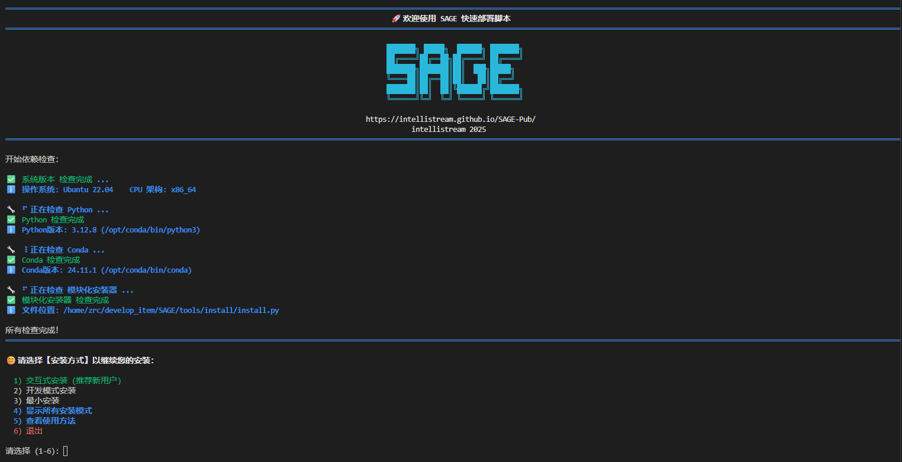
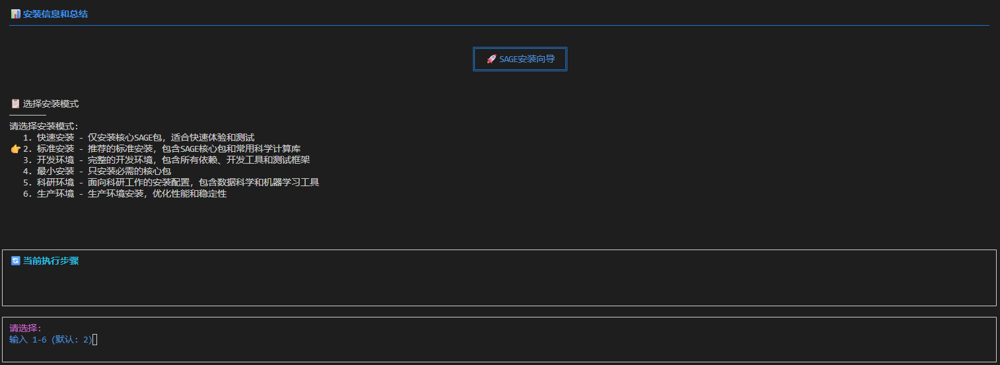
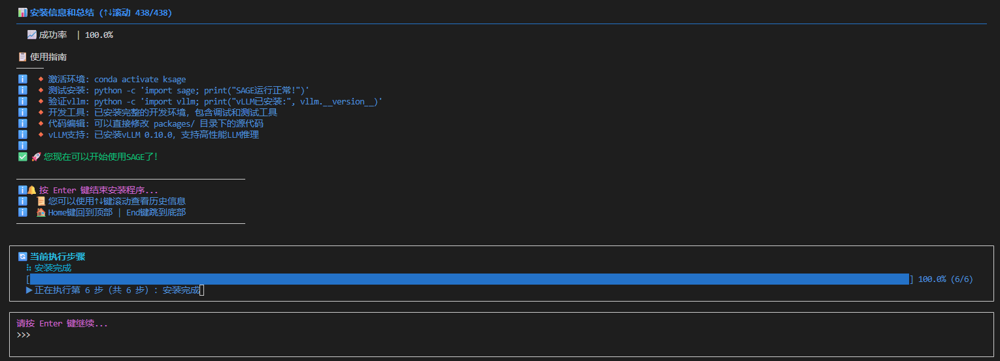
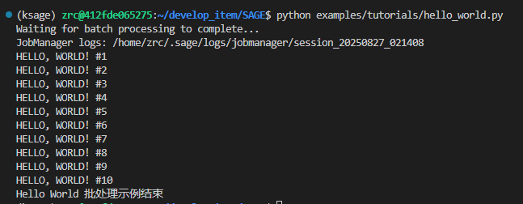

# SAGE 安装指南

本文档将指导您如何以 **开发者模式** 安装 SAGE 源码及其相关依赖。

---

## *A*. 前置要求 (Prerequisites)

在开始安装之前，请确保您的开发环境满足以下要求：

* **操作系统 (OS)**：[Ubuntu 22.04及以上版本](https://ubuntu.com/)
* **基础依赖**：[Anaconda/Miniconda](https://www.anaconda.com/)
* **SAGE官方仓库**：[IntelliStreamSAGE](https://github.com/intellistream/SAGE)
<!-- 仓库链接待修改 -->
<small>您也可以通过以下命令快速拉取 SAGE 官方仓库</small>

<!-- 仓库链接待修改 -->
```bash
git clone git@github.com:intellistream/SAGE.git
```

---

## *B*. 本地安装 (Installation)

**第 1 步：运行安装脚本**

在本地的 SAGE 目录下，可见一个quickstart.sh的脚本，提前 **拉长终端边框** ，运行该脚本一键式安装 SAGE：

```bash
./quickstart.sh
```

运行该脚本后，您的终端会显示以下输出：

[](../assets/img/quickstart_intro.png)


**第 2 步：选择环境名称**

在终端中，输入 ++3+enter++, 以指定创建 SAGE 环境的名称： 

指定您希望创建的 SAGE 环境名称并 ++enter++ ，等待安装程序开始安装。
[](../assets/img/quickstart_install_1.png)

静待片刻后，显示以下页面，完成 SAGE 环境部署：

[](../assets/img/quickstart_install_2.png)

---

## *C*. 验证安装 (Verify Installation)

执行 SAGE 目录下的 [`hello_world.py`](https://github.com/intellistream/SAGE/blob/main/examples/tutorials/hello_world.py) 文件：

```bash
python examples/tutorials/hello_world.py
```

出现如下输出，说明 SAGE 安装成功，祝您使用愉快~

[](../assets/img/quickstart_install_3.png)

---

## *D*. 常见问题 (Common Question)

:octicons-info-16: **SAGE-Pub Failed to connect / 子模块设置失败**

报错内容大致如下：

```bash title="bash error"
fatal:unable to access'https://github.com/intellistream/SAGE-Pub.git/': Failed to connect_to github.com_port 443 after 118564 ms: Could not connect to server
```

这一般是因为网络原因导致无法与 github 建立连接，建议科学上网并切换到虚拟网卡模式重试。

## *E*. CI/CD 开发指南

### 嵌入模型 CI/CD 集成

在 CI/CD 环境中，neuromem 测试可能因为无法下载 HuggingFace 模型而失败。SAGE 提供了完整的解决方案来处理这个问题。

#### 问题背景
- CI/CD 环境中网络访问可能受限
- HuggingFace 模型下载可能失败
- 之前版本会静默回退到 MockEmbedder，导致测试结果不可靠

#### 解决方案

**1. 预缓存模型（推荐）**

在 CI/CD pipeline 中添加模型缓存步骤：

```yaml
# GitHub Actions 示例
- name: Cache embedding models
  run: |
    python tools/cache_embedding_models.py --cache
```

**2. 使用本地模型缓存**

如果 CI/CD 环境支持缓存，可以缓存 transformers 模型：

```yaml
- name: Cache transformers models
  uses: actions/cache@v3
  with:
    path: ~/.cache/huggingface/transformers
    key: ${{ runner.os }}-transformers-${{ hashFiles('**/requirements.txt') }}
```

**3. 环境变量配置**

设置 HuggingFace 镜像源以提高下载成功率：

```yaml
env:
  HF_ENDPOINT: https://hf-mirror.com
```

#### 本地测试命令

```bash
# 验证模型缓存
python tools/cache_embedding_models.py --check

# 缓存模型
python tools/cache_embedding_models.py --cache

# 清除缓存（用于测试）
python tools/cache_embedding_models.py --clear-cache

# 自动模式（检查并在需要时缓存）
python tools/cache_embedding_models.py
```

#### 脚本特性

- ✅ **智能检查**: 首先检查本地缓存，避免不必要的网络请求
- 🔄 **自动重试**: 网络失败时自动重试，使用指数退避策略  
- 🌍 **镜像支持**: 自动使用 HuggingFace 镜像源提高下载成功率
- ⏱️ **超时控制**: 合理的超时设置避免长时间等待
- 🗑️ **缓存管理**: 支持清除缓存用于测试和故障排除

## *F*. 安装演示 （Installation Demo）

<iframe 
  src="https://player.bilibili.com/player.html?bvid=BV1uKYNz8EEm" 
  scrolling="no" 
  border="0" 
  frameborder="no" 
  framespacing="0" 
  allowfullscreen="true" 
  style="width: 800px; height: 500px;">
</iframe>
