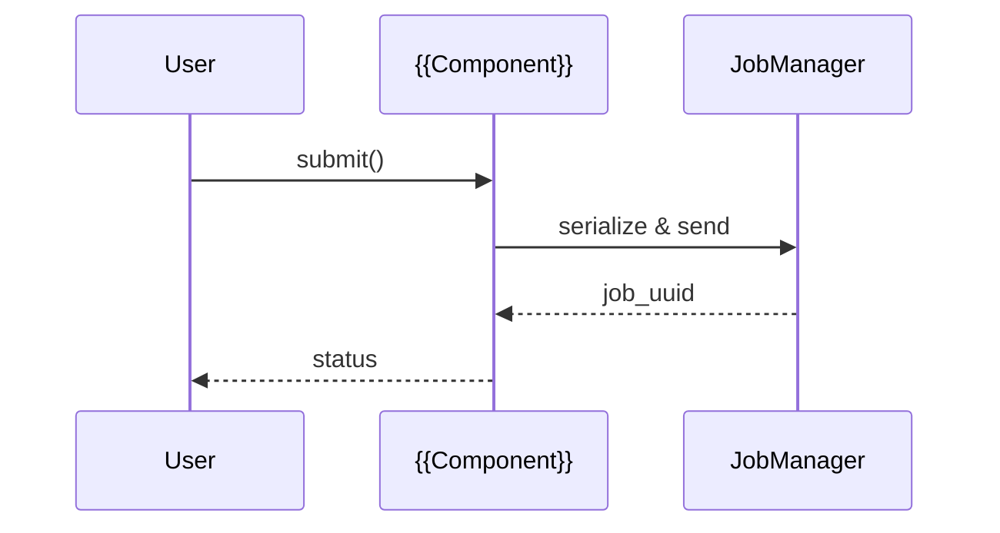

# SAGE 子章节写作模板

用于撰写章节内的“细分主题”页面（例如某个组件、工具、子系统）。保留此模板并复制一份到新的 Markdown 文件，根据实际情况替换占位符。建议在页面最上方注明最后更新时间与维护人，便于后续跟进。

!!! info "主题定制提示"
    如果需要同步调整首页或 MkDocs 主题样式，请参考《[主题自定义指南](theme_overrides.md)》，其中包含 overrides 与 Jinja 模板的维护说明。

---

## Step 0 · 页面信息

- **一句话定位**：说明该子章节解决什么问题、适用场景和预期产出。
- **读者画像**：`新成员 / 进阶用户 / 维护者` 等。
- **前置阅读**：列出必读文档或先修知识（例如 “推荐先读 `get_start/quickstart.md`”）。

```markdown
!!! tip "Prerequisites"
    - 基础概念：RAG / Agent / Ray Runtime
    - 推荐阅读：[章节导览](../join_sage/overview_template.md)
```

---

## Step 1 · 快速开始示例

通过 1~2 个最小可运行的示例降低上手门槛，可选多种视角呈现：

=== "Python"
    ```python title="Minimal Example" linenums="1"
    from sage.core.api.local_environment import LocalEnvironment
    from sage.core.api.function.map_function import MapFunction

    class {{Operator}}(MapFunction):
        def execute(self, data):
            return data

    env = LocalEnvironment("{{pipeline_name}}")
    env.from_source(...).map({{Operator}}).sink(...)
    env.submit(autostop=True)
    ```
=== "CLI"
    ```bash title="命令行用法"
    sage {{subcommand}} init {{project}}
    sage {{subcommand}} run --config config.yaml
    ```

若示例依赖配置文件或数据集，请提供下载方式与体积大小，并标记预计运行时间。

---

## Step 2 · API / CLI 速查

列出最常用的入口、方法签名或命令行参数，帮助读者快速定位：

```python title="核心类签名"
class {{ClassName}}:
    def __init__(self, *, option: int = 1): ...
    def run(self, payload: dict) -> dict: ...
    async def arun(self, payload: dict) -> dict: ...
```

| 命令 | 说明 | 常用参数 |
| --- | --- | --- |
| `sage {{sub}} start` | 启动 {{组件}} | `--config`, `--daemon` |
| `sage {{sub}} status` | 查看运行状态 | `--verbose` |

> 详细参数可链接到 API Reference 或源代码所在模块，例如 `packages/sage-tools/src/sage/tools/cli/commands`。

---

## Step 3 · Parameters · Returns · Errors

采用表格说明关键参数、返回值与常见异常：

| 参数 | 类型 | 必填 | 默认值 | 说明 |
| --- | --- | --- | --- | --- |
| `source_path` | `str` | ✅ | — | 数据输入路径 |
| `batch_size` | `int` | ⭕ | `128` | 需根据 GPU 显存调节 |

| 返回字段 | 类型 | 备注 |
| --- | --- | --- |
| `job_uuid` | `str` | 远程作业 ID，可用于 `sage job show` |

| 错误 | 触发条件 | 解决方式 |
| --- | --- | --- |
| `ValueError` | 配置缺少必要字段 | 检查 YAML，参考示例 |
| `HTTP 429` | 调用第三方 API 触发限流 | 增加退避或申请更高配额 |

---

## Step 4 · 工作机制 & 设计动机

用文字 + 图示描述架构、数据流或状态机，便于读者理解原理：



!!! info "设计与取舍"
    - 为什么选择 {{底层技术}}：{{原因}}
    - 已知限制：例如「仅支持批处理」「需手动清理资源」
    - TODO：后续计划或改进方向

---

## Step 5 · 进阶配置 / 调优

| 配置键 | 类型 | 默认值 | 场景 | 调优建议 |
| --- | --- | --- | --- | --- |
| `autostop` | `bool` | `false` | 批处理 | 设置为 `true` 可在作业完成后自动清理 |
| `max_retries` | `int` | `3` | 远程提交 | 根据网络稳定性调节 |

可附上“常见组合配置”示例，或链接到 `configs/` 目录中的实际 YAML 文件。

---

## Step 6 · 参考与维护

- 关联源码目录：`packages/{{module}}`、`examples/{{subdir}}`
- 最近更新记录：`2025-09-xx by @username`
- 维护人：`@owner`
- 常见问题：链接到 FAQ or GitHub Issues

保持这一节在每次重要改动后更新，帮助读者确认信息是否仍然有效。
