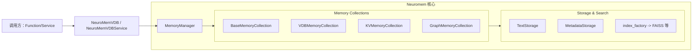

# Neuromem（长期记忆组件）

Neuromem 是 SAGE Middleware 中的持久化记忆栈，当前仓库的实现集中在 Python 代码，提供向量化存储、检索和落盘能力。仓库未包含额外的 `MemoryService` 包装，请直接使用 Neuromem 模块提供的类或微服务示例。

- **代码根目录**：`packages/sage-middleware/src/sage/middleware/components/neuromem/`
- **核心组成**：
  - `memory_manager.py`
  - `memory_collection/`（Base/VDB/KV/Graph 集合）
  - `search_engine/`、`storage_engine/`（索引与存储后端）
  - `micro_service/`（`NeuroMemVDB` 与 `NeuroMemVDBService` 封装）
- **默认数据目录**：`data/neuromem_vdb/`（可通过 `MemoryManager(data_dir=...)` 自定义）

---

## 一、快速使用示例

```python
from sage.middleware.components.neuromem.micro_service.neuromem_vdb import NeuroMemVDB

# 创建管理器并注册集合（不存在则按配置创建）
vdb = NeuroMemVDB()
vdb.register_collection(
    "qa_collection",
    {
        "embedding_model": "sentence-transformers/all-MiniLM-L6-v2",
        "dim": 384,
        "description": "QA memory",
    },
)

# 插入文本（所有已注册集合都会收到）
vdb.insert("Python 是一种编程语言", {"tag": "intro"})
vdb.insert("FAISS 用于向量检索", {"tag": "retrieval"})

# 构建并初始化索引（默认 global_index）
vdb.build_index(index_name="global_index")

# 检索
print(vdb.retrieve("向量数据库是什么？", topk=3, with_metadata=True))

# 持久化到磁盘
vdb.store_to_disk()
```

如需将集合暴露为 `BaseService`，可在完成索引创建后实例化 `NeuroMemVDBService`：

```python
from sage.middleware.components.neuromem.micro_service.neuromem_vdb_service import NeuroMemVDBService

service = NeuroMemVDBService("qa_collection")
results = service.retrieve("检索问题", topk=3, with_metadata=True)
```

> 注意：`NeuroMemVDBService` 假设集合存在 `global_index`，并依赖 `VDBMemoryCollection`。若您修改索引名称，请同步调整服务代码或在实例化后调用 `_create_index`。

---

## 二、组件结构



- **MemoryManager**：负责集合创建、懒加载、状态持久化（`manager.json`）。
- **MemoryCollection 系列**：封装文本/元数据/索引操作；VDB 是当前主要使用的实现。
- **Storage / Search Engine**：`storage_engine` 提供文本与元数据的本地存储，`search_engine` 通过工厂模式创建向量索引。
- **Micro Service**：`NeuroMemVDB` 面向脚本和测试，`NeuroMemVDBService` 提供 `BaseService` 兼容接口。

---

## 三、主要 API 摘要

### MemoryManager（`memory_manager.py`）

| 方法 | 说明 |
| --- | --- |
| `create_collection(config: Dict[str, Any])` | 根据 `name` 与 `backend_type` 创建集合，返回 `BaseMemoryCollection` 子类实例。|
| `get_collection(name)` | 优先返回内存中的集合；若集合仅在磁盘上，自动懒加载。|
| `list_collection(name=None)` | 返回集合元数据及状态。|
| `store_collection(name=None)` | 将已加载的集合落盘，并刷新 `manager.json`。|
| `delete_collection(name)` | 删除内存、元数据及磁盘记录。|
| `rename(former, new, description=None)` | 重命名集合并更新描述。|

### VDBMemoryCollection（`memory_collection/vdb_collection.py`）

| 方法 | 说明 |
| --- | --- |
| `batch_insert_data(data, metadatas=None)` | 批量插入文本与元数据，生成稳定 ID。|
| `create_index(config)` | 根据配置创建索引（需提供 `name`、`embedding_model`、`dim`、`backend_type` 等）。|
| `init_index(name, metadata_filter_func=None, **conditions)` | 把符合条件的数据批量导入索引。|
| `insert(index_name, raw_text, metadata=None)` | 直接向指定索引写入单条文本。|
| `retrieve(raw_text, index_name, topk=5, threshold=None, with_metadata=False, ...)` | 使用创建好的索引进行检索，可附带元数据筛选。|
| `store(store_path=None)` / `load(name, vdb_path=None)` | 序列化与反序列化集合。|

### NeuroMemVDB（`micro_service/neuromem_vdb.py`）

- 封装 `MemoryManager`，提供 `register_collection`、`insert`、`retrieve`、`build_index`、`store_to_disk` 等快捷方法。
- 内建 `online_register_collection` 字典，用于缓存当前进程已连接的集合。

### NeuroMemVDBService（`micro_service/neuromem_vdb_service.py`）

- 继承 `BaseService`，在构造时接入已存在的集合并默认使用 `global_index` 检索。
- `retrieve(query_text, topk=5, collection_name=None, with_metadata=False, **kwargs)`：对单个或全部注册集合进行检索，自动附加 `source_collection` 字段。

---

## 四、持久化与目录结构

默认情况下，Neuromem 会在工作目录下创建 `data/neuromem_vdb/`，结构如下：

```
data/
  neuromem_vdb/
    manager.json              # 集合元信息
    vdb_collection/
      <collection_name>/
        texts.jsonl           # TextStorage 底层文件
        metadata.jsonl        # MetadataStorage 底层文件
        indexes/
          <index_name>/…      # 索引序列化结果
```

可通过 `MemoryManager(data_dir=...)` 或覆盖 `NeuroMemVDB._get_default_data_dir()` 修改路径。

---

## 五、实践建议与限制

- **索引准备**：在使用服务封装前，务必确保集合已有可用索引（推荐命名为 `global_index` 以兼容默认实现）。
- **嵌入模型可用性**：`EmbeddingModel` 加载 HuggingFace 模型失败时会抛出异常；在离线或 CI 环境可改用 `method="mockembedder"`。
- **KV/Graph 状态**：`KVMemoryCollection` 与 `GraphMemoryCollection` 目前仅提供骨架，尚未配套上线级索引；生产环境请使用 VDB 版本。
- **扩展函数序列化**：`VDBMemoryCollection` 对过滤函数进行了序列化/反序列化支持，但需确保函数可被 `inspect.getsource` 获取源码。
- **Service 接入**：服务层没有远程调用或注册中心，`NeuroMemVDBService` 仅作为进程内封装示例。

---

如需更深入的嵌入或索引配置，请参考源码：

- `memory_collection/vdb_collection.py`
- `search_engine/vdb_index/`
- `utils/embedding/embedding_model.py`
- `micro_service/neuromem_vdb.py`