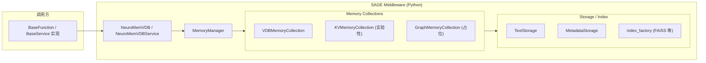

# SAGE Middleware 概览

SAGE Middleware 是 SAGE 推理框架的中间层模块，目前主要围绕 Python 实现的记忆系统展开，提供向量存储、检索以及嵌入接入等能力。完整的微服务网格、服务发现和硬件亲和调度尚未在当前仓库落地，本文仅覆盖已经实现的功能。

## 主要模块

| 功能 | 代码位置 | 描述 |
| --- | --- | --- |
| Neuromem 记忆栈 | `packages/sage-middleware/src/sage/middleware/components/neuromem/` | 包含 `MemoryManager`、`BaseMemoryCollection` 族、搜索/存储引擎以及示例化的 `NeuroMemVDB` 与 `NeuroMemVDBService`。 |
| SageDB / SageFlow 组件 | `packages/sage-middleware/src/sage/middleware/components/sage_db/`<br>`packages/sage-middleware/src/sage/middleware/components/sage_flow/` | 提供可选的 C++ 扩展及对应的 Python 绑定，包含 `SageDBService`、`SageFlowService` 等轻量封装；需要单独构建后才能启用。 |
| 嵌入模型工具 | `packages/sage-middleware/src/sage/middleware/utils/embedding/` | `EmbeddingModel` 统一封装 HF、OpenAI、Jina、Mock 等多家提供商，失败时显式抛出错误。 |
| 扩展兼容检测 | `packages/sage-middleware/src/sage/middleware/components/extensions_compat.py` | 导入时检测可选的 C++ 扩展 (`sage_db` / `sage_flow`)，缺失时降级为 Python 实现并提示安装步骤。 |

## 运行结构



### 关键流程

1. **集合生命周期管理**：`MemoryManager` 负责创建、懒加载、重命名及落盘集合，默认持久化路径为 `data/neuromem_vdb/`。
2. **数据写入**：`VDBMemoryCollection.batch_insert_data` 将文本写入 `TextStorage`，同时根据元数据动态注册字段并存入 `MetadataStorage`。
3. **索引构建**：通过 `create_index`/`init_index` 使用 `index_factory` 创建 FAISS 等后端索引，并缓存到 `index_info`。
4. **检索**：`retrieve` 根据查询向量进行语义搜索，可选返回元数据或套用自定义过滤函数。
5. **服务封装**：`NeuroMemVDB` 和 `NeuroMemVDBService` 提供面向脚本与 `BaseService` 的轻量封装，便于在 Flow 或 Agent 中复用。

## 能力概览

- 🧠 **向量化记忆**：内置索引工厂支持批量插入、增量更新与多索引管理。
- 💾 **持久化恢复**：集合结构由 `manager.json` 记录，文本/向量/索引按目录分层存储，随时 `store_collection` 与 `load`。
- 🔌 **嵌入接入**：`EmbeddingModel` 自动匹配模型维度，对 HF 模型加载失败进行显式报错，同时提供 mock 嵌入用于测试。
- 📦 **服务化入口**：`NeuroMemVDB` 提供一站式注册/写入/索引/检索；`NeuroMemVDBService` 将已有集合暴露为 `BaseService`。
- ⚙️ **扩展探测**：`extensions_compat` 在模块导入时输出扩展可用性，便于判断是否启用了 C++ 加速。

## 当前限制

- 公共文档中提到的 Memory/KV/Graph 独立服务、服务发现与负载均衡尚未实现；所有调用均在单进程内完成。
- `KVMemoryCollection` 与 `GraphMemoryCollection` 仍处于骨架阶段，默认推荐使用 VDB 版本。
- Ray、消息队列等分布式通信能力目前仅在内核层示例出现，Middleware 层还未集成。

## 快速上手

```python
from sage.middleware.components.neuromem.micro_service.neuromem_vdb import NeuroMemVDB

# 1. 初始化并注册集合（不存在则创建）
vdb = NeuroMemVDB()
vdb.register_collection(
    "qa_collection",
    {
        "embedding_model": "sentence-transformers/all-MiniLM-L6-v2",
        "dim": 384,
        "description": "QA memory",
    },
)

# 2. 写入数据
vdb.insert("Python 是一种编程语言", {"tag": "intro"})
vdb.insert("FAISS 用于向量检索", {"tag": "retrieval"})

# 3. 构建索引（默认 global_index，使用 mock/hf 嵌入）
vdb.build_index(index_name="global_index")

# 4. 检索
results = vdb.retrieve("向量数据库是什么？", topk=3, with_metadata=True)
print(results)

# 5. 持久化
vdb.store_to_disk()
```

如需与 `BaseService` 协同，可在注册集合并创建索引后实例化 `NeuroMemVDBService`，再接入 `BaseFunction.call_service[...]`。

## 相关文档

- [`components/neuromem.md`](./components/neuromem.md)
- [`service/memory/memory_service.md`](./service/memory/memory_service.md)
- [`service/neuromem/vdb/vdb.md`](./service/neuromem/vdb/vdb.md)
- 嵌入实现详见 `packages/sage-middleware/src/sage/middleware/utils/embedding/embedding_model.py`
